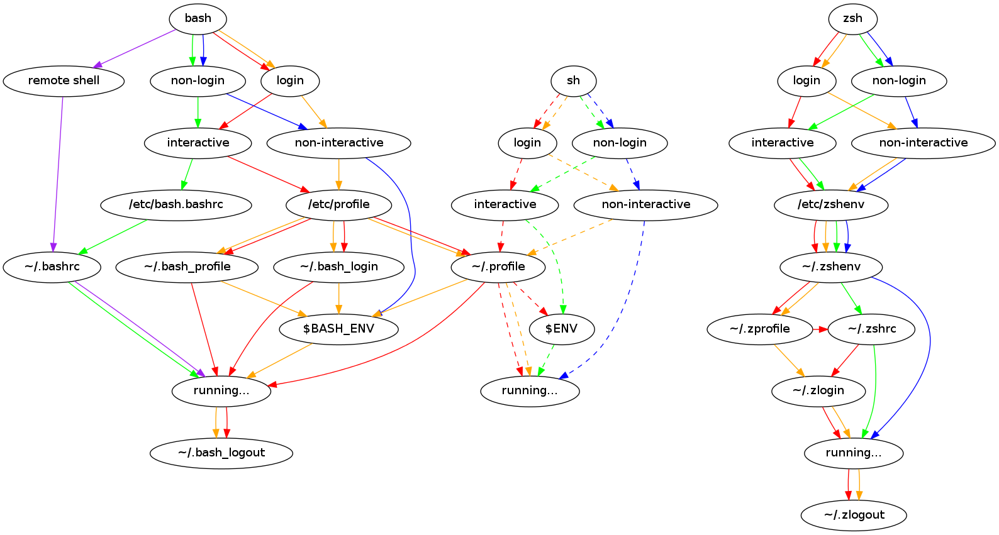

# path_helper on MacOS with ZSH

*Note: This guide does not cover Bash. See the references if you use Bash or another shell.*

`path_helper` is an executable built into macOS that facilitates TODO

From the manpage:

> Prior to reading these directories, default PATH and MANPATH values are obtained from the files /etc/paths and /etc/manpaths respectively. (The MANPATH environment variable will not be modified unless it is already set in the environment.)
>
> The path_helper utility reads the contents of the files in the directories /etc/paths.d and /etc/manpaths.d and **appends** their contents to the PATH and MANPATH environment variables respectively.
>
> Files in these directories should contain one path element per line.

#### Where does path_helper run?

`path_helper` runs in your global shell configuration, which on macOS is stored under `/etc` sans the prefixing dot. In the case of ZSH it is inside of `/etc/zprofile`.

### UNIX shell modes

Which initialization files get sourced by the shell is dependent on the combination of modes in which a particular shell process runs. There are two main, non-exclusive modes:

* login - e.g. when user logs in to a system with non-graphical interface or via SSH;
* interactive - shell that has a prompt and whose standard input and error are both connected to terminals.

These modes can be manually activated with the following flags to bash/zsh:

* `-l, --login`
* `-i`

### ZSH configuration load order

ZSH loads configuration files differently depending on the shell mode:

1. `/etc/zshenv`
2. `~/.zshenv` - **This is loaded everytime and is designed for environment variables**
3. **login** mode:
   1. `/etc/zprofile` - **This is where `path_helper` is loaded**
   2. `~/.zprofile`
4. **interactive**:
   1. `/etc/zshrc`
   2. `~/.zshrc`
5. **login** mode:
   1. `/etc/zlogin`
   2. `~/.zlogin`

## Dealing with this

We have multiple approaches available, but I consider some of these to be antipatterns. Let's just cover those first.

### Antipatterns

#### Using path deduplication

ZSH includes a feature to stop additions to `$PATH` if it already contains the entry using the configuration option `typeset -U PATH path`.

While this seems like a convenient solution it ultimately breaks visibility into what is manipulating `$PATH` and where that manipulation occurs which can result in unanticipated behaviour in your shell.

Some programs may prepend or append into path at a certain point again to ensure correct overrides, even though duplication is clearly the result of incorrect behaviour somewhere, we might break the shell and struggle to find the source of this behaviour if we're removing the duplication.

#### Ignoring the global configuration

ZSH includes the ability to ignore the global configuration using `unsetopt GLOBAL_RCS`. I don't think this is wise given I've seen software that relies upon inserting configuration into these files.

I would rather be aware that something has been inserted there and then shift it myself, if needed, into my local configuration.

#### Removing `path_helper`

This is similar to the antipattern above. Other programs may leverage the behaviour of path_helper.

#### Avoiding .zshenv

I find this isn't really practical for modern development as lots of package managers or automation run in a subshell, and expect your `$PATH` to have the same binaries included as you do from an interactive shell.

### My philosophy

This is more personal to me, but I've never had an issue with avoiding `zlogin` and `zprofile` and just using `zshenv` and `zshrc`. It adds more complexity than I need to have anything more than two scenarios:

* A shell that I interact with (`.zshrc` and `.zshenv`)
  * Additions to my shell that support my using of it
* A shell that a program runs in directly (`.zshenv`)
  * My global configuration, variables, binaries, and commands that are always available

The majority of terminal emulators and IDEs let you configure your shell, so I always ensure to remove any login/profile flags to get the behaviour I want and skip the extra time of loading another file.

To this end I also add a warning into `.zprofile` to let me know if it's being loaded.

## References

* https://github.com/apple-oss-distributions/shell_cmds/tree/main/path_helper
* https://github.com/sambacha/dotfiles2/
* https://github.com/rbenv/rbenv/wiki/Unix-shell-initialization
* https://gist.github.com/Linerre/f11ad4a6a934dcf01ee8415c9457e7b2